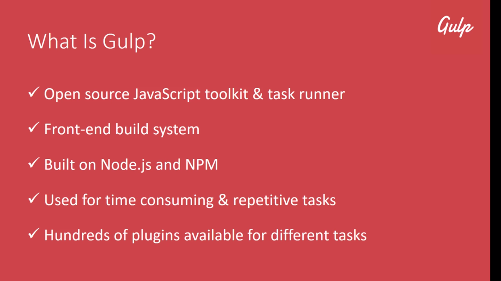
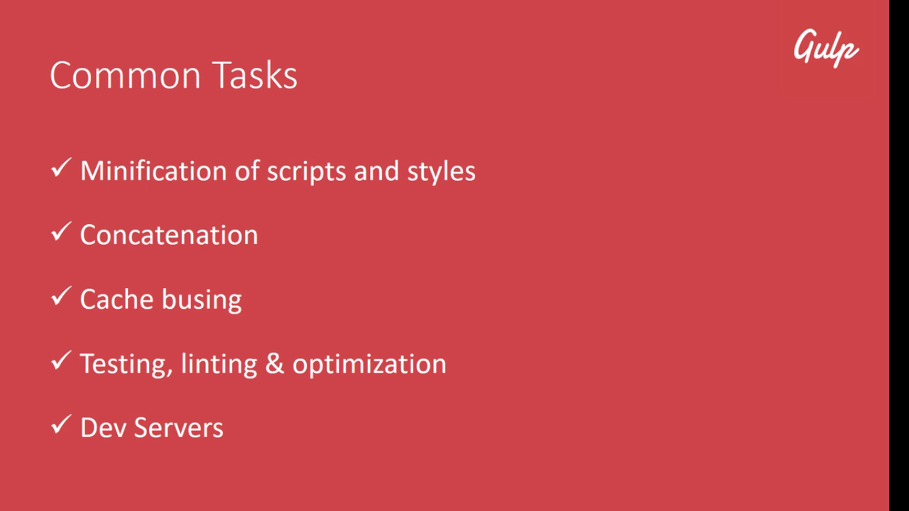
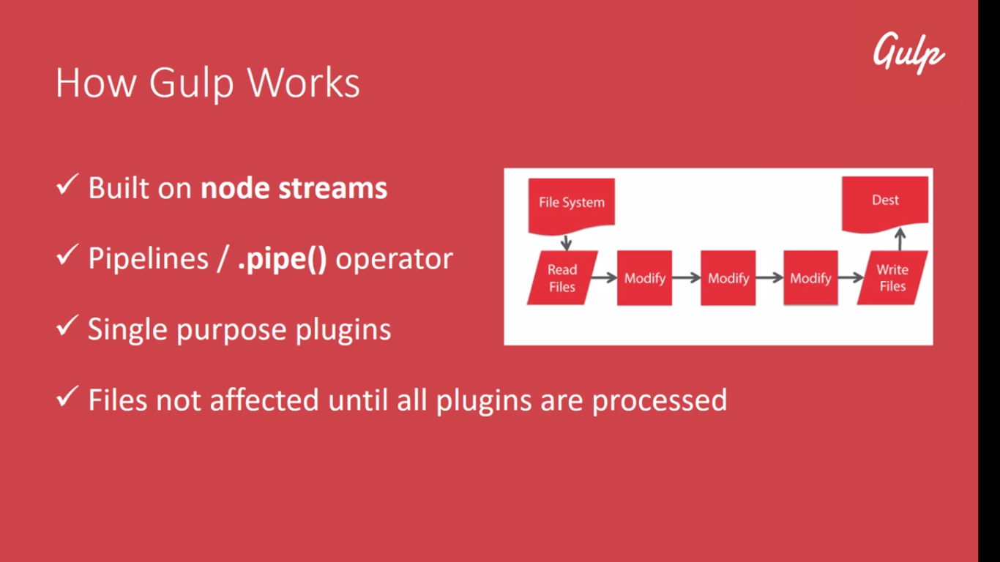

# [Gulp Example App](https://github.com/sheilambadi/gulp-example-app)
Learning gulp so as to contribute to the [Popcorn Time Desktop](https://github.com/popcorn-official/popcorn-desktop) application

Visit [gulp.js](https://gulpjs.com/ "gulpjs") for more information on using gulp.

## Getting Started
[Clone](https://github.com/sheilambadi/gulp-example-app) this repository and build a number of assets using gulp.

The master branch contains the latest release.

#### Quickstart
1. `gulp ` or `gulp watch`

If you encounter trouble with the above method, you can try:

1. `npm install gulp-cli -g ` (Linux: you may need to run with `sudo`)
1. `gulp ` or `gulp watch`

## What is Gulp

## Common Tasks 

## How Gulp Works

## Gulp vs Grunt

## License
 
**MIT License**

&copy; 2018 Sheila Mbadi

Permission is hereby granted, free of charge, to any person obtaining a copy
of this software and associated documentation files (the "Software"), to deal
in the Software without restriction, including without limitation the rights
to use, copy, modify, merge, publish, distribute, sublicense, and/or sell
copies of the Software, and to permit persons to whom the Software is
furnished to do so, subject to the following conditions:

The above copyright notice and this permission notice shall be included in all
copies or substantial portions of the Software.

THE SOFTWARE IS PROVIDED "AS IS", WITHOUT WARRANTY OF ANY KIND, EXPRESS OR
IMPLIED, INCLUDING BUT NOT LIMITED TO THE WARRANTIES OF MERCHANTABILITY,
FITNESS FOR A PARTICULAR PURPOSE AND NONINFRINGEMENT. IN NO EVENT SHALL THE
AUTHORS OR COPYRIGHT HOLDERS BE LIABLE FOR ANY CLAIM, DAMAGES OR OTHER
LIABILITY, WHETHER IN AN ACTION OF CONTRACT, TORT OR OTHERWISE, ARISING FROM,
OUT OF OR IN CONNECTION WITH THE SOFTWARE OR THE USE OR OTHER DEALINGS IN THE
SOFTWARE.
